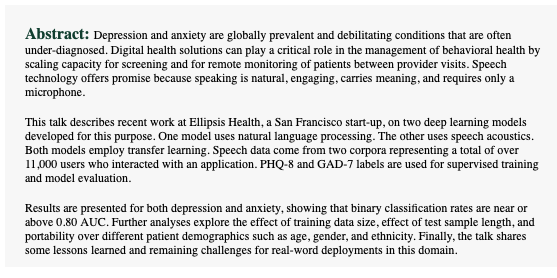
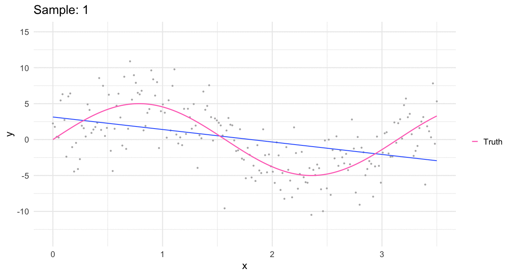
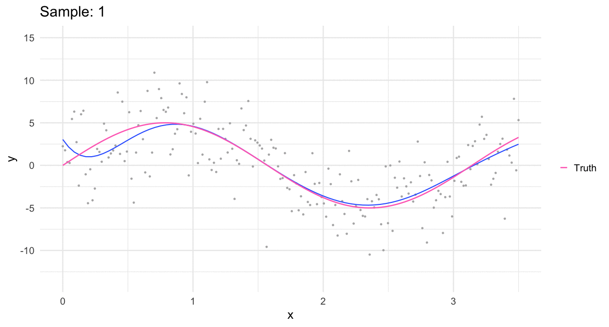

```{r setup, include = FALSE}
knitr::opts_chunk$set(fig.width = 13, 
                      message = FALSE, 
                      warning = FALSE,
                      echo = TRUE)

library(tidyverse)

update_geom_defaults('path', list(size = 3, color = "cornflowerblue"))
update_geom_defaults('point', list(size = 5, color = "gray60"))
theme_set(theme_minimal(base_size = 25))
```

# Agenda 
* Modeling for inference vs prediction


--
* Train and test datasets


--
* Objective functions (briefly)


--
* Bias-Variance tradeoff of and overfitting


--
* Supervised vs unsupervised learning


--
* Regression vs Classification

---
# Check in and announcements

* How's the start of your term going?

* Anything unclear or that you'd like to discuss?

* Please remember to email us with your group!
  + Ideally, please have this settled by the end of today

---


---


[RSVP Here](https://urldefense.com/v3/__https:/oregon.qualtrics.com/jfe/form/SV_bx4862NYcmcnNg9__;!!C5qS4YX3!XOuDAPFLxffMTm3Bs5-MN0EESFaOjwxJj5DQioA89VGClJ10O5RhT0dB6ihwsd4$)

---
class: inverse center middle
# Inference vs Prediction

---
# What's the difference?
Focus of most stats classes is on inference

--
### Example RQ's
* What is the relation between the proportion of students eligible for 
  free/reduced price lunch and a school's Annual Performance Index?


--
* What is the effect of a reading intervention for struggling readers, as
  compared to treatment as usual?


--
* To what extent does the effect of internalizing/externalizing behavior on
  sexual risk depend upon their adverse childhood experiences?

---
# Standard errors
* One of the defining features of modeling for inference is the estimation of a
  standard error for a given estimate


--
* How certain are we of the population-level estimate?


---
# Prediction
* Rather than  inferring population-level values, the focus shifts to 
  building a "machine" that produces predictions for us on new (unseen) data


--
* Less focus on population-level values, or even model interpretability.


--
* Primary focus - how well does our model perform?


--
* Standard errors of your coefficients are generally not as important as the model prediction error

---
# Another way to think of it
### Our linear regression model

$$\color{#157CAE}{\text{Y}_{i}} = \text{X}_{i} \color{#DB1593}{\beta} + e_i$$


--
When modeling for inference, we want an unbiased (consistent) and precise estimate $\color{#DB1593}{\hat\beta}$.

--

For prediction, we shift our focus to accurately estimating outcomes.


--

In other words, how can we best construct $\color{#157CAE}{\hat{\text{Y}}_{i}}$?

---
## ... so?

So we want "nice"-performing estimates $\hat y$ instead of $\hat\beta$.

.r[Q]: Can't we just use the same methods (_i.e._, OLS)?

--

.b[A]: It depends.


--
 How well does your .bolder[.r[linear]]-regression model approximate the underlying data? (And how do you plan to select your model?)


---
# Why might we want to do this?
* Forecasting is useful


--
* What is the likelihood that a kindergarten student will be reading on
  "grade-level" by third grade?


--
* What is the likelihood that a given student has a disability?


--
* What is the likelihood that a given student will drop out of high-school?


--
### In each case:
* Build a predictive model
* Use the model to forecast/predict 
* Update the forecast/prediction as more data are collected
* Taylor instruction/intervention to these forecasts


---
# Example forecast plot

```{r forecast, echo = FALSE}
library(forecast)
USAccDeaths %>%
  tbats() %>%
  forecast() %>%
  autoplot() + 
  ggtitle("")
```


---
# A warning


---
* Lots of misunderstanding out there about what predictive modeling is, and 
  many people will disparage it


--
* .bolder[My view:] 
  + these people generally have an incomplete (at best) understanding of
    predictive modeling
  + Often have antiquated views of the techniques used in predictive 
    modeling (i.e., not about maxing out $R^2$)

--
### Bottom line
* Predictive modeling has been used with enormous success 
* These models are used in production business environments all the time
* These modeling techniques impact all of our lives on a daily basis

---
class: inverse center middle

# The antiquated method

---
# Stepwise regression
* Often when people bad-talk predictive modeling, it's because they're thinking 
  of stepwise regression


--
### Basic approach
* Throw a bunch of variables at a problem, only keep those that are significant


---
# Approaches
* **Forward selection:** Start with no variables, add one at a time, but only
  keep if significant


--
* **Backward selection:** Start with all variables, remove one at a time based
  on the variable that is "least significant"


--
* **Stepwise selection:** Sequentially add predictor variables based on "most
  significant". After each addition, cycle through and remove 
  non-significant variables


--
### Goal
* Find the optimal subset of variables that could be used to predict the 
  outcome

---
# Reasons for critique
* $p$ values were not designed for variable selection decisions! 

* Even if we wanted to use them, why use $\alpha = 0.05$, rather than what works best
for the given problem?


--
### More importantly
* People use this model **for inference** which is straight-up bonkers


--
### Why are we talking about this?
* It actually can still be an okay method if all you care about is variable selection. 

* Make you aware that others may use it inappropriately, and to caution you (in the strongest way possible) not to use it for inference.

---
# Stepwise criteria
* Applying different criteria (forward, backward, etc.) can lead to 
different "optimal" variable combinations


--
* From a predictive modeling framework, this isn't really a big deal - we only
care about which model performs best.


--
* From an inference perspective, it's a REALLY big deal - that's why we don't
use these models for inference 
  + Little to no theory guiding decisions, except which variables will be
    included in the automatic procedure (which is often all available variables)

---
class: inverse center middle
# How do we determine "performance"

---
# Model performance criteria
* If the primary concern is prediction, what do we care about the most?

--

.center[### How close our predictions to the observed data?]


--
.Large[🤨]

* Wait, isn't that basically the same thing as residual variance?


--
### No! 
* Why? We want to know how far off our model is for .bolder[.b[cases outside our sample]!]

---
# Test/Train datasets

* Our goal is to maximize .bolder[.b[out-of-sample]] predictive accuracy. How can 
  we get an estimate of that? Leave out part of the sample.

--

1. Split the raw data into "training" and "test" datasets


--
2. Build a model on the training dataset


--
3. Do everything you can to make the model the "best" you can


--
4. When you've settled on a .bolder[final] model, use the parameter estimates
  to predict the outcome on the test data
  
--
5. Use an objective function to evaluate how far off your predictions were from the real values

---
# Quick example

```{r train-test}
library(tidyverse)
set.seed(8675309)
train <- mtcars %>%
  sample_frac(.8)

test <- anti_join(mtcars, train)
nrow(train)
nrow(test)
```

---
# Fit model(s)
* Only use the training data

```{r train-mods}
m1 <- lm(mpg ~ hp, train)
m2 <- lm(mpg ~ hp + disp, train)
m3 <- lm(mpg ~ hp + disp + cyl, train)
sundry::aic_weights(m1, m2, m3)
```

--
### Settle on a model 

It's basically a toss-up between `m2` and `m3`. I'll go with the more parsimonious model.

---
# Predict new cases

```{r test_preds}
test <- test %>%
  mutate(pred_mpg = predict(m2, newdata = test))

test
```

--
Consider *how* you want to evaluate how well your model performed (what objective function to use).


--
In this case, we'll look at the root mean square residual (RMSE), which we want to minimize

---
# Calculate differences

```{r diff}
test %>%
  mutate(diff = pred_mpg - mpg)
```

--
What's the average difference? 


--


---
# What do we do?

--
* Square then average the values

--
### Mean square error

.Large[
$$
MSE = \frac{1}{n}\sum(y\_i - \hat{y\_i})^2
$$
]


--
### Root mean square error

.Large[
$$
RMSE = \sqrt{\frac{1}{n}\sum(y\_i - \hat{y\_i})^2}
$$
]


---
# Objective function
* MSE and RMSE are examples of **objective functions**, 
**cost functions**, or **loss functions**. There are many of these, which we'll talk more about later in the term.

* Goal of ML - optimize (maximize or minimize) the objective function

* These are all [similar but not equivalent](https://stats.stackexchange.com/questions/179026/objective-function-cost-function-loss-function-are-they-the-same-thing) terms


---
# Evaluate 

```{r mse}
test %>%
  summarize(mse = mean((pred_mpg - mpg)^2))
```

```{r rmse}
test %>%
  summarize(rmse = sqrt(mean((pred_mpg - mpg)^2)))
```

--
* Note, you can only evaluate against the test set once! Otherwise, your test 
dataset becomes part of your training dataset.


--
* Instead, you do this process over and over **with your training dataset** through a process called $k$-fold cross-validation, which we'll talk about next week.

---
## $k$-fold CV basics

* Split the data into multiple little samples

  
--
* Leave out one piece, try different models on the other pieces, predict on left out piece


--
* Evaluate against objective function


--
### Joe will cover this more next week

---
class: inverse center middle
# Overfitting
### And thinking more about functional form

.Large[
$$
\hat{Y} = f(\mathbf{X})
$$
]


---
# Predicting income
* Imagine we are trying to predict respondents' income. 


--
* In this case, the data have been simulated, so .b[we know] the 
  functional form


--

.center[


]

---
# We could fit a linear relation

.center[


]

---
# Or a more complex model

.center[


]

---
# Or a really complicated model

.center[


]

---
* The linear model doesn't fit the observed data as well .gray[(it is
  slightly underfit)]


--
* The really complex model model fits the observed data nearly perfectly 
  .gray[(it is overfit)]


--
* The middle model fits the observed data well, and matches the underlying
  function well. 

--
* We know this because we know the underlying function - usually we do not.

---
# Overfitting in action

.center[


]


---
class: inverse center middle
# Bias-Variance Trade-off

---
# Types of errors in prediction
<br/>

--
### Bias
How well does the model represent the observed data?


--
### Variance
How much does the model change from sample to sample?


---
# Linear models
Tend to have low variance

--
### But also...
Can have high bias, if the underlying functional form is not *truly* linear


---
# Highly flexible models
Tend to have low bias (representing the observed data well)

--
### But also...
Can easily overfit, leading to high variance


--
### The goal
* Balance the bias-variance trade-off


--
* Note, this is an incredibly useful perspective **even if your goal is
  to model for inference.**


---
# More gifs!
Why the linear model has low variance


---
Why it may have high bias




---
# A crazy polynomial model
Why more complicated models have higher variance


---
Why it may have lower bias



---
# More precise definitions

.pull-left[
### Bias
* Difference between the .gray[(average, oftentimes)] prediction of our model and the "true" value

* Equivalent to statistical bias

* How well the model fit the underlying structure of the data?

* Low bias = closer to “truth”

* High bias = systematically ignores structure in the data

]


--
.pull-right[
### Variance
* Variability of the model predictions for a given point
* Variability of predictions if the model were repeated with small differences in the data 

* Degree that model predictions are influenced by these changes = variance

* High variance models generalize to unseen data poorly

]

---
background-image:url(https://sebastianraschka.com/images/blog/2016/model-evaluation-selection-part2/visual_bias_variance.png)
background-size: contain


---
background-image:url(https://bradleyboehmke.github.io/HOML/02-modeling-process_files/figure-html/modeling-process-bias-model-1.png)
background-size: contain
# Low variance - moderate bias

.footnote[https://bradleyboehmke.github.io/HOML/process.html#bias-var]
---
background-image:url(https://bradleyboehmke.github.io/HOML/02-modeling-process_files/figure-html/modeling-process-variance-model-1.png)
background-size: contain
# High variance - low bias

.footnote[https://bradleyboehmke.github.io/HOML/process.html#bias-var]

---
# General model characteristics

### Less flexible, but low variance 
* Linear regression
  * Ridge/lasso
* Partial least squares

--
### More flexible, but higher variance
* $KNN$
* Decision trees
* Neural networks

---
background-image:url(https://cdn.analyticsvidhya.com/wp-content/uploads/2020/08/Copy-of-Add-a-subheading5.png)
background-size: contain

.footnote[https://www.analyticsvidhya.com/blog/2020/08/bias-and-variance-tradeoff-machine-learning/]

---
# Strategies for optimizing
### Hyperparameter tuning
Many machine learning models include parameters that must be set by the analyst, which control the flexibility of the model
  
### Regularization
Reduce how much the model learns. Many different strategies, including
* Penalties on model fit
  + Highly complex models are penalized higher, leading to less likelihood of being selected
* Shrinkage
  + Systematically reduce the influence of a given parameter, or sets of parameters
* Dropout
  + Randomly drop trees/nodes in the learning process
---
class: inverse center middle
# Regression versus classification

--
# Supervised versus unsupervised learning


---
# What are you trying to predict?
* Continuous (or approximately continuous) response variable?

  + Regression problem
 

--
* Categorical response variable?

  + Classification problem
  

--
* Simplest examples: 
  
  + Linear regression 
  
--
  .b[regression]
  

--
  + Logistic regression
  
--
  .r[classification]
  
  
--
  + Ordinal or multinomial regression

--
  .r[classification]


---
# Supervised/unsupervised
* Supervised: You have .b[*labeled*] data


--
### What does labeled mean?


--
* Just that you have scores or classifications or whatever for the thing you're trying to get the machine to "learn".


--
* Unsupervised: No labels

---
# Supervised/unsupervised
* Supervised learning is fairly straightforward - you have values of some outcome for a sample. Try to build a model to predict the values people outside of your sample would have.

* Unsupervised
	- Clustering problems
	- Latent class/mixture modeling
	- No way to "know" a case belongs to a certain class/response level

  
---
# Pop quiz

`r countdown::countdown(minutes = 5, top = 0)`

<br/>

Talk with your neighbor to determine whether each of the following is a .b[regression] or .r[classification] problem .bolder[AND] whether it is a .b[supervised] or .r[unsupervised] problem.

Note - there is no "correct" answer for some of these, it depends on how it's framed

* Develop an algorithm that determines if students will be reading on grade level by the third grade, according to a statewide test.
* Predict which students will be at risk for reading difficulties.
* Estimate who is most at risk to drop out of high school.
* Determine specific objects in an image
* Decode handwriting to text
* Estimate the likelihood of having a learning disability


---
class: inverse
# Next class
Ethics in Machine Learning.
Guest lecture: [Sondra Stegenga](https://www.linkedin.com/in/sondra-stegenga/)

<br/>

.center[]