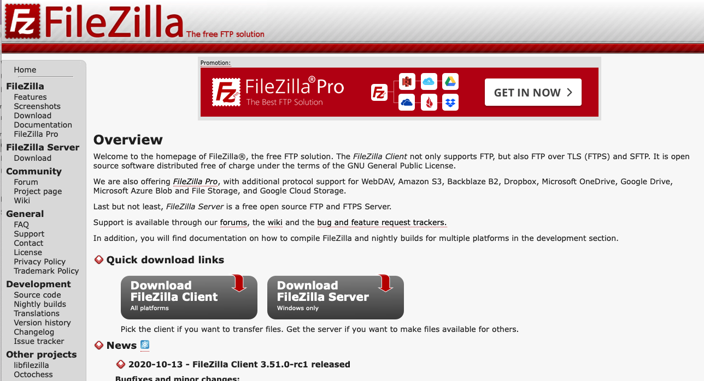
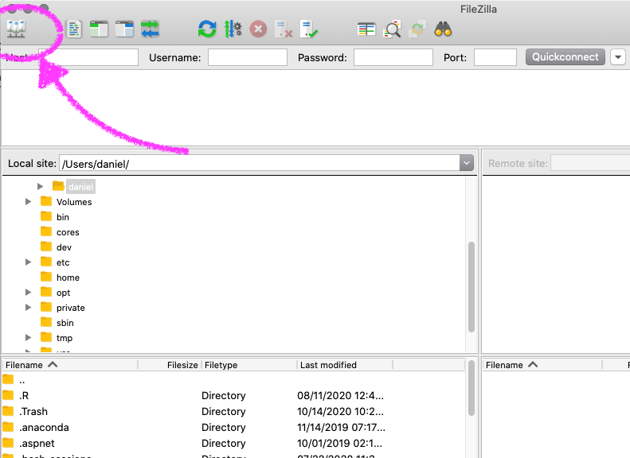
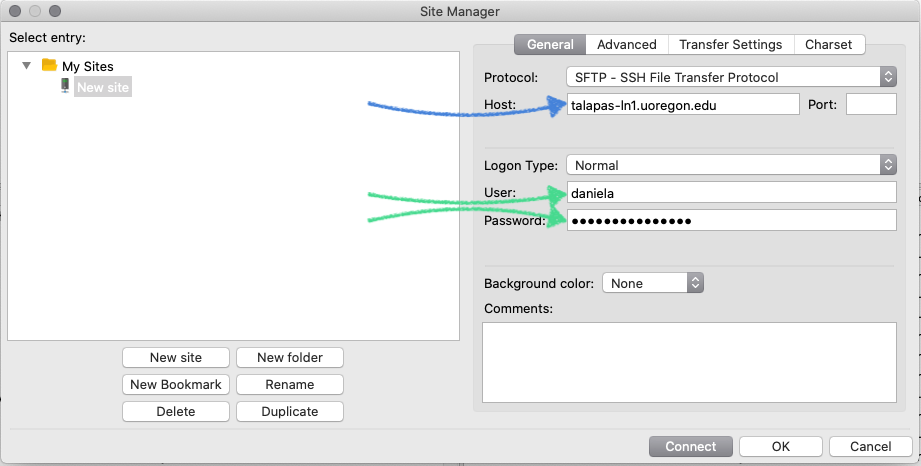
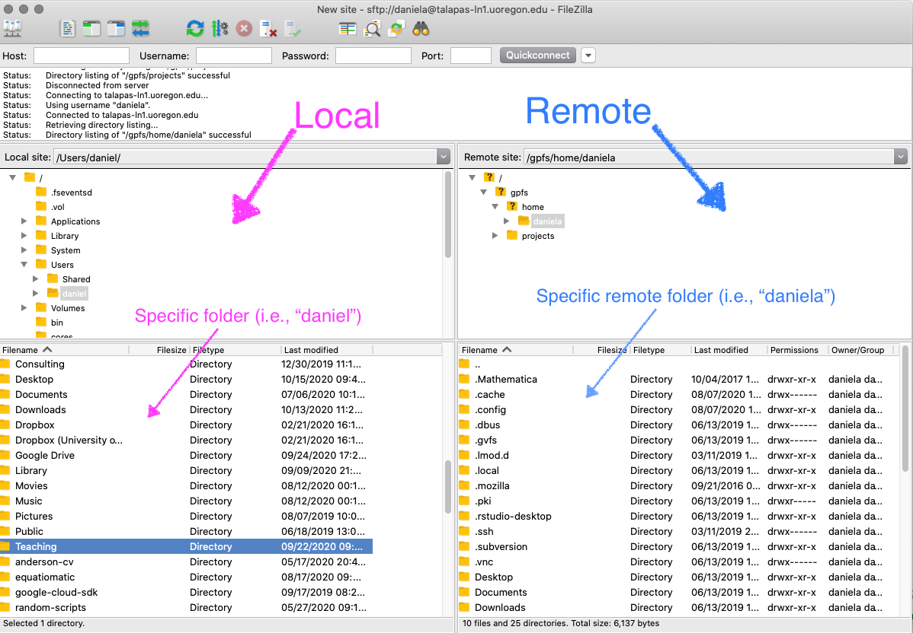
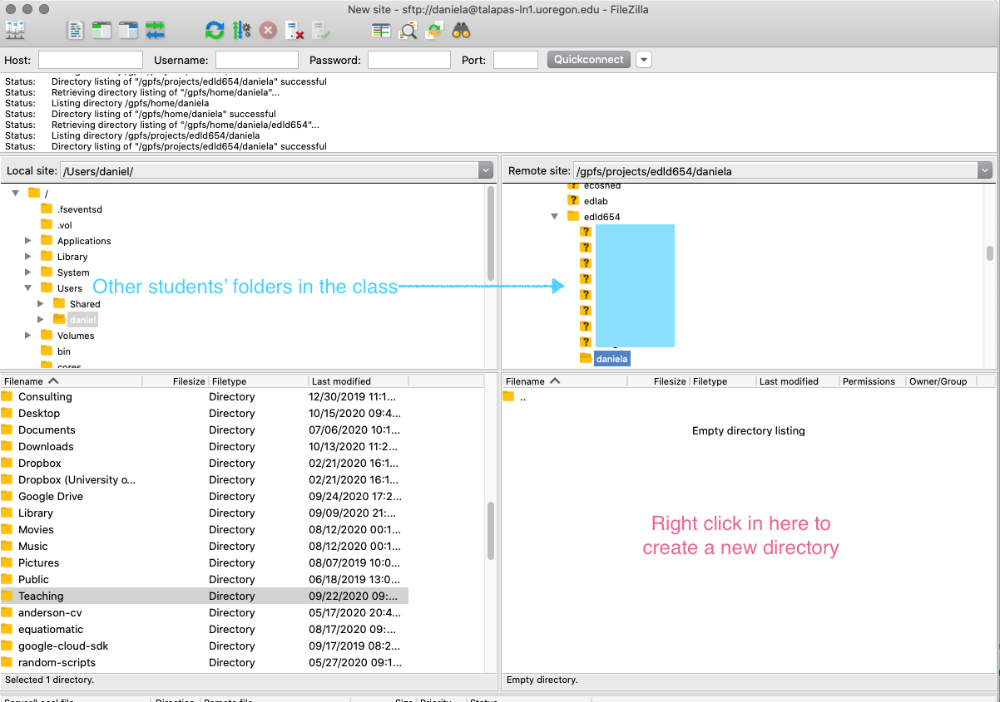
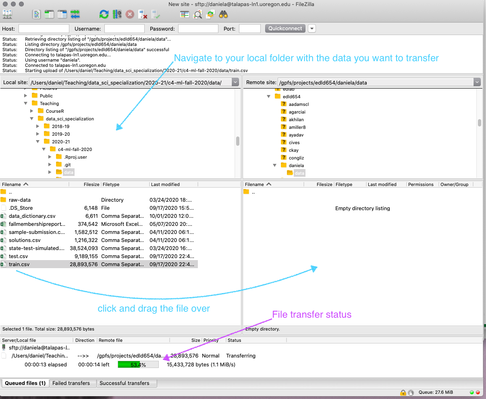
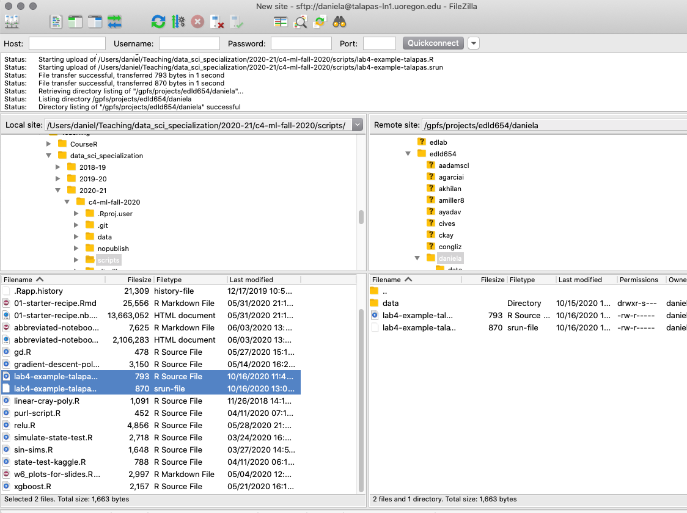
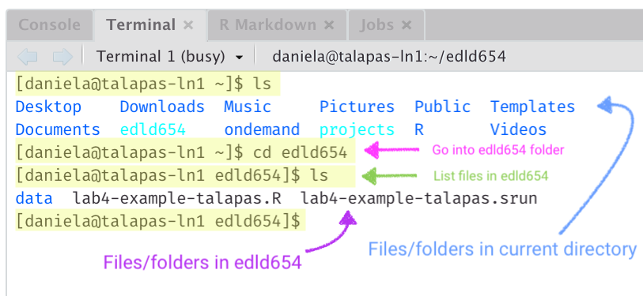
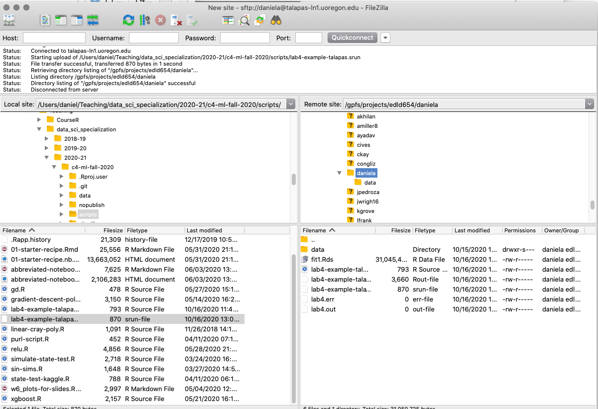

```{r setup, include = FALSE}
knitr::opts_chunk$set(fig.width = 13, 
                      message = FALSE, 
                      warning = FALSE,
                      echo = TRUE)
```

# Agenda 
* Moving files to talapas
* Running R scripts
  + slurm & batch processing
  + connections, making sure paths are correct, etc.

---
# HPC Generally
* Lots of other options
  + Amazon Web Service ([AWS](https://aws.amazon.com/ec2/?hp=tile&so-exp=below&ec2-whats-new.sort-by=item.additionalFields.postDateTime&ec2-whats-new.sort-order=desc))
  + [Google Compute Engine](https://cloud.google.com/compute/)
  
We will be using [talapas](https://hpcf.uoregon.edu/content/talapas), which is the UO supercomputer, but the process should be similar for other cloud-based compute engines

---
# Prerequisite
[FileZilla](https://filezilla-project.org) is a GUI (graphic user interface) that helps you move files around without having to stay in the terminal the whole time. I find it to be really helpful, and we'll use it today.



---
# Connect
* First, let's open filezilla and connect to talapas
  + Note - you must be connected to UO servers (use a VPN if you're off campus)




---


.b[talapas-ln1.uoregon.edu] or .b[talapas-ln2.uoregon.edu]. Either will work, so if one seems busy, try the other.

Your .gr[duckid] and UO .gr[password]

---


---
Create a new "data" folder in your project on the remote, and put the training data there.

* On the remote side, click on your username (e.g., "daniela") then scroll down and find "edld654". You should see an empty folder.

* Right click in the empty folder and create a new directory. Name it "data"

---



---
# Transfer file



---
class: inverse center middle
# Submitting a job
We'll start off with a simple R script

---
class: right
background-image:url(img/talapas-rscript-1.png)
background-size:contain

---
# Important notes about the script
* It's not really practical to use [{here}](https://here.r-lib.org) when working with talapas. Use relative paths instead.

* .bolder[Always] make sure you save whatever it is you're running. Then move it back to your local to continue working with it.

---
# Job time
On my local computer (pretty new, 8-core 2.4GHz processor with 32 GB of RAM) this script took about 1.4 minutes to run.

This is not long enough to warrant talapas. Should probably be jobs of *at least* 30 minutes on your local.

We'll go forward with it anyway as a basic example

---
# Install
We first have to get R setup with the appropriate packages. You should have already done this, but let's go through it again just to refresh our memory.

You will have to do this anytime you want to install any new R package

.boler[Note:] talapas uses an older version of R (3.6.0). Generally this isn't a problem. If a package you want isn't available for 3.6.0, try installing it through the github repo (with `remotes::install_github`). If that doesn't work, check in with me.


---
# Connect via ssh
If you're on a mac, use terminal (as with the screenshots), otherwise use [MobaXterm](https://mobaxterm.mobatek.net)


---
# login to talapas
Type the following, replacing `duckid` for your actual duckid (you could use `ln2` if you want).

`ssh duckid@talapas-ln1.uoregon.edu`


You will then be prompted for your password.

### Important!

When you type in your password (UO password) it will not show any characters you type. Just trust that it is actually registering them.

---
background-image:url(img/talapas-login-terminal-rstudio.png)
background-size:contain

---
# Install packages
Now that you're into talapas, just type `R` and you'll be in an R console

Once there, just install the packages like normal. For example, maybe you need the `janitor` `patchwork` packages too. Use

```{r pkg-install, eval = FALSE}
install.packages(c("janitor", "patchwork"))
```

---
# warnings
You will get a warning about the directory not being writable. 

* Say "yes" when asked if you'd like to write to a personal library instead.
* Say "yes" when asked if you would like to *create* a personal library
* Select a CRAN mirror. I usually use 1 (0-Cloud) which is RStudio's mirror.

---
class: inverse center middle
# slurm and batch processing

---
# slurm
talapas uses [slurm](https://slurm.schedmd.com) to prioritize which jobs get processed in which order.

Many things will effect how quickly your job moves from the queue to actually being processed. The most important of these are:

* How many resources you request
* How long you state that you expect the job to take


--
You submit your job to talapas via a slurm script, which ends in `.srun`

---
class: center middle

<iframe src="https://giphy.com/embed/djmLI3XeC8LaU" width="480" height="207" frameBorder="0" class="giphy-embed" allowFullScreen></iframe><p><a href="https://giphy.com/gifs/dead-dying-djmLI3XeC8LaU"></a></p>


---
I know this is a lot, but stick with me for a bit, we're almost there


--
You should have an example `.srun` script. Let's walk through it together.


--
You can edit these in RStudio, but it might be easier to use a different text editor. I use [Sublime Text](https://www.sublimetext.com) but it seems like most the cool kids are using [VS Code](https://code.visualstudio.com) these days.


--

Each command starts with a comment, `#`

--

Specify the interpreter

```
#!/bin/bash 
```

This is the top line

---
# Partition

```
#SBATCH --partition=short
```

This is where you determine where your job should go. Most of our jobs will be short, which is for any jobs that take less than a day to run. Jobs between 1-14 days go to `--partition=long`.

You can also send the job to short or long GPU's or nodes with huge amounts of memory.

See the full partition list [here]( https://hpcrcf.atlassian.net/wiki/spaces/TCP/pages/7285967/Partition+List).

---
# Job name

Just the name of the job you are submitting. Can be anything. Not super important.

```
#SBATCH --job-name=lab4-example
```

---
# Output

For our purposes, this is usually not terrifically important either. But it will output basically what R runs as if you watched it in the console. Again, call it something that is meaningful, but it's not super important.

```
#SBATCH --output=lab4.out
```

---
# Errors

If you have errors with your job, they'll show up here. Filename should be similar to the name and the output.

```
#SBATCH --error=lab4.err
```

---
# Time

.pull-left[
This is .bolder[super] imporant! You have to put a time that you know the job will complete in. 

So if you say 2 minutes and the job isn't complete by then, it will bomb out.

BUT, the longer you put, the further you'll get pushed down the queue. So overestimate, but try to not overestimate by *too* much. 

How do you know? 

]

--

.pull-right[


Hard to say. Just give a best guess, and overestimate by a ways.

This is for 1 hour

```
#SBATCH --time=0-01:00:00
```

Timing goes Days-HH:MM:SS
]

---
# Resources

* Nodes

* Tasks per node

* CPUs per task

Number of physical CPU cores = number of nodes $\times$ number of tasks-per-node $\times$ number of cpus-per-task 

* Memory

---
# Nodes
For this class, one node should be sufficient. A node on the cluster is basically one big computer. A standard compute node (what we'll be using) has 28 cores and 128GB of RAM (memory). If you have big jobs later that you want to run, you could use a GPU instead, and/or use multiple nodes (but you have to make sure your process can run in parallel).

```
#SBATCH --nodes=1
```

---
# Tasks per node
For this class, generally you will just want to run one task per node.

```
#SBATCH --ntasks-per-node=1
```

---
# CPUs per task
If you only have 1 node and 1 task, this is really straightforward - just the number of cores you want to use. Let's start of small with 4. 

```
#SBATCH --cpus-per-task=4	
```

Note - if you can't run things in R in parallel, this won't be helpful. Most things in R are "single-threaded" by default. In this case, the 4 CPUs are probably not getting us anything extra. But later we'll see examples where it's easy to parallelize. 

---
# Memory
Can be specified either with the `--mem` flag to declare the total memory needed, or the `--mem-per-cpu` flag to allocate a specific amount of memory for each CPU. 

The default is "an allocation proportional amount of available RAM from the node", so 1 core on a node with 28 cores and 128GB of ram would have $128/28=4.57$ GB of memory.

Let's up our memory to 10GB per CPU, or 40GB total.

```
#SBATCH --mem-per-cpu=10GB
```

.bolder[Note]: if you run something that is single threaded, you could still boost the memory here a lot for significant gains.


---
# Account
This is the account associated with the job. For this class, it will be edld654.

```
#SBATCH --account=edld654
```

And that's it!

---
# Full script

```
#!/bin/bash
#SBATCH --partition=short        
#SBATCH --job-name=lab4-example  
#SBATCH --output=lab4.out        
#SBATCH --error=lab4.err         
#SBATCH --time=0-01:00:00        
#SBATCH --nodes=1                
#SBATCH --ntasks-per-node=1      
#SBATCH --cpus-per-task=4				 
#SBATCH --mem-per-cpu=10GB       
#SBATCH --account=edld654        
```

---
# Wait!
What about actually running the R Script?

That's what comes next! We put a call in the `.srun` script that asks terminal to run R in batch mode (i.e., automatically run a script) and call our script from there.

You can do this even on you local computer. Use `R CMD BATCH [options] infile.R [outfile]`

We have the file save in the `.srun` file so we'll go with

```
R CMD BATCH --no-save --no-restore lab4-example-talapas.R
```

This goes after all the commented slurm code.

---
class: inverse center middle

# Move files and run analysis!

---
# First move the files



---
# Then go back to terminal

* First you have to get into the same folder you were looking at on FileZilla. Use `ls` to see the files in your current directory, and `cd` to change directories


---
# Run the job

* To run the job, type `sbatch` followed by the name of your `.srun` file. For this particular job, I would type

```
sbatch lab4-example-talapas.srun
```

---
# Check the status of your job
To see all jobs in the queue, type `squeue`. To see where your jobs are in the queue, type `squeue -u duckid`, replacing `duckid` with your duckid.


This provides some basic information on what you called, the name of the job, who you are, the status of the job (`ST`), how long it's been running, and the number of nodes it's using.

Status will be one of PD (pending), R (running), or CG (completing)

---
# Back to FileZilla
Immediately you won't see your output. You need to go into a different folder, then come back to "refresh it"


Then just move the files over, and you're good to go!

---
# Wrapping up
This has been a lot. Don't worry if you're feeling overwhelmed. 

You only *have* to use it for this one lab. After that, you can use it if it's helpful.

Sometimes the gains can be *enormous* and some analyses are just not feasible on your local computer.

Playing with the resources you request will change run time and wait time for your job to submit.

Parallel computation can also help

In this case, the job was so small that none of these made much of a difference