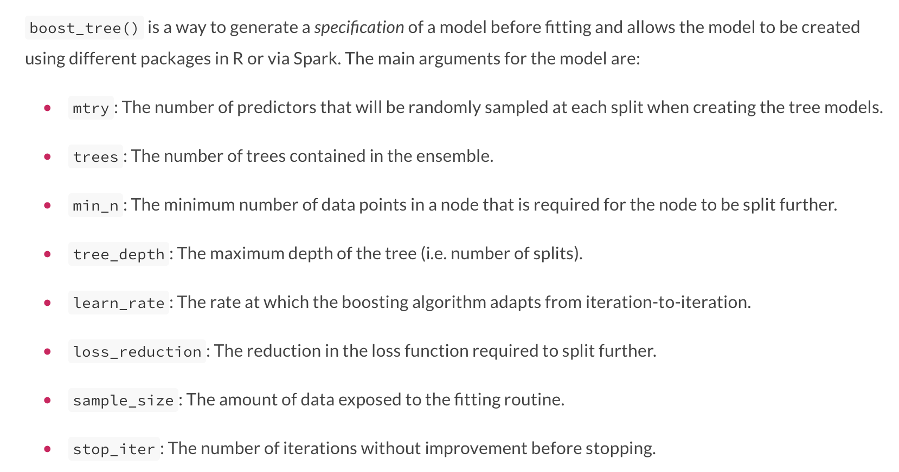

```{r setup, include = FALSE}
knitr::opts_chunk$set(fig.width = 13, 
                      message = FALSE, 
                      warning = FALSE,
                      echo = TRUE,
                      cache = TRUE)

library(tidyverse)

update_geom_defaults('path', list(size = 3, color = "cornflowerblue"))
update_geom_defaults('point', list(size = 5, color = "gray60"))
theme_set(theme_minimal(base_size = 25))
```

# Agenda
* Boosting

* Gradient descent

* Standard boosted tree hyperparameters

* Additional hyperparameters with **{xgboost}**

* Initial implementation with {tidymodels}
  
  + This will mostly be for Wednesday

---
# Quick scheduling note
* Next Monday, we have a scheduled work day. This is intended for you to work with your group on your final project, while having Joe and I present to help you work though any problems

  + If you are having specific issues, that would be a great time for us to help you solve them
  
  + Otherwise, it's a designated time for you all to work together
  

--
* Next Wednesday, we will cover [Keras](https://keras.rstudio.com/index.html) in [#rstats](https://twitter.com/hashtag/rstats)

* Keras is a high-level API for neural nets - can use numerous back-ends for estimation, including [TensorFlow](https://www.tensorflow.org)


---
# Before Wednesday!

Please run the following:

```{r install-keras, eval = FALSE}
install.packages("keras")
keras::install_keras()
```

We'll run through some basic models and hopefully have you fitting some basic neural nets by the end

Please do this ASAP, and if you run into issues, please contact me

---
# Quick review

* For bagged trees and random forests, we create $b$ bootstrap resamples of the training data. We then fit a model to each resample and aggregate the results for a single prediction


--
* Random forests include an additional stochastic component, sampling $m$ features for each split in each tree for every resample, which can help decorrelate the trees and lead to better predictions


--
* For each of these models, you need a *sufficient* number of resamples to obtain a stable estimate, but additional resamples will only "cost" in terms of computational efficiency 


---
# Boosting

* Like bagging, boosting is a general algorithm that can be applied to any model, but it's very common with trees


--
* Like bagging, boosting is an ensemble approach, where many models are fit to the data


--
### Key difference from bagging
* Rather than using boostrapping, boosted models are built .b[.ital[sequentially]], with each model fit to the residuals from the previous


--
* information from tree 1 .b[feeds into] tree 2, which .b[feeds into] tree 3... etc.


---
background-image: url(https://bradleyboehmke.github.io/HOML/images/boosted-trees-process.png)
background-size: contain
# Boosting illustrated


.footnote[https://bradleyboehmke.github.io/HOML/gbm.html]


---
# Components of boosting

* .bolder[.b[Base learner]]: The model that is iteratively fit. Can be any model but is regularly a .ital[shallow] decision tree


--
* .bolder[.b[Weak models]]: Improves error rate only slightly more than chance. The weak learning is boosted by the iterative fit, and the model learns slow 

    + Trees with 1-6 splits are common


  
--
* .bolder[.b[Sequential fit]]: See algorithm on next slide

---
# Sequential fitting algorithm

1. Fit a decision tree to the data: $f_1\left(x\right) = y$


--
2. Fit a second decision tree to the residuals of the first: $h_1\left(x\right) = y - f_1\left(x\right)$


--
3. Add the trees together to obtain an ensemble algorithm: $f_2\left(x\right) = f_1\left(x\right) + h_1\left(x\right)$


--
4. Fit a new decision tree to the residuals of this model: $h_2\left(x\right) = y - f_2\left(x\right)$


--
5. Add this tree to our ensemble: $f_3\left(x\right) = f_2\left(x\right) + h_2\left(x\right)$


--
6. Continue onward until some criterion (stopping rule) is met

---
# Final Model

$$
f\left(x\right) =  \sum^B_{b=1}f^b\left(x\right)
$$

---
# Slow learning

* Boosted models typically .ital[learn slow], which may sound bad, but is actually helpful in finding an optimal solution


--
* Each tree is very shallow, and learns little about the data on its own


--
* By contrast, random forests include aggregation across many deep, independent trees (i.e., each tree learns a lot, but variance is reduced through averaging)


---
background-image: url(https://bradleyboehmke.github.io/HOML/10-gradient-boosting_files/figure-html/boosting-in-action-1.png)
background-size: contain
class: inverse

### Slow Learning Illustrated

.footnote[https://bradleyboehmke.github.io/HOML/gbm.html]


---
# Note, this doesn't mean it's always optimal

* In a simple linear regression case, where we *know* how the data were generated, linear regression still wins!

* This can be the case even if we *don't know* how the underlying data were generated, but the problem is relatively simple.


---
# Quick example

```{r }
set.seed(3)

# parameters
alpha <- 10
b1 <- 5
x <- 1:100
log_x <- log(x)
e <- rnorm(length(x), sd = 0.8)

#outcome
y <- alpha + b1*log_x + e

sim <- data.frame(x, y)
```


---
# Plot

```{r }
library(tidyverse)
ggplot(sim, aes(x, y)) +
  geom_point()
```

---
# Modeling
* In this case, the "best" model is one that models exactly the function that created the data - log transforming `x`

* We can get *close* to this with a spline

* Although a boosted tree model is often among the best "out of the box" models, it will not do as well as either of the previous models, in this (very simple case)

---
# Illustration

### Create recipes for log transformation and a B-spline

Quick side-note: Any idea why I'm using a B-spline instead of a natural spline?

```{r }
library(tidymodels)
rec_log <- recipe(y ~ x, sim) %>% 
  step_log(x)

rec_spline <- recipe(y ~ x, sim) %>% 
  step_bs(x, deg_free = tune())
```

---
# Candidate models

* I'm omitting the code for for boosted trees because I'll be fitting it outside of the **{tidymodels}** framework, but we'll get there soon (wiht **{tidymodels}**).

```{r }
# linear regression
lin_mod <- linear_reg() %>% 
  set_mode("regression") %>% 
  set_engine("lm")
```

---
# Create CV object, estimate

```{r }
cv_lin <- vfold_cv(sim)

# fit log transform
log_fit <- fit_resamples(lin_mod, rec_log, cv_lin)
collect_metrics(log_fit)
```

---
# Tune spline

```{r }
grid_spline <- grid_regular(deg_free(c(3, 25)), 
                            levels = 15)
tuned_spline <- tune_grid(lin_mod, 
                          rec_spline,
                          cv_lin,
                          grid = grid_spline)

rec_spline_f <- finalize_recipe(rec_spline,
                                select_best(tuned_spline, metric = "rmse"))

fit_spline <- fit_resamples(lin_mod, rec_spline_f, cv_lin)
collect_metrics(fit_spline)
```

---
# Standard boosted tree

```{r echo = FALSE}
library(gbm)

gbm_cv <- map(cv_lin$splits,  ~{
  train <- analysis(.x)
  test <- assessment(.x)
  
  m <- gbm(
    formula = y ~ x,
    data = train,
    interaction.depth = 1,
    distribution = "gaussian",  # SSE loss function
    n.trees = 500
  )
  data.frame(observed = test$y,
             predicted = predict(m, newdata = test))
})
metrics <- map_df(gbm_cv, ~{
  bind_rows(
    rmse(.x, truth = observed, estimate = predicted),
    rsq(.x, truth = observed, estimate = predicted)
  )
}, .id = "fold")

metrics %>% 
  group_by(.metric, .estimator) %>% 
  summarize(mean = mean(.estimate),
            n = 10,
            std_err = sd(.estimate))
```

Note that the boosted tree model has both lower average performance *and* higher variance.

--

Does that mean it's a crappy model and we shouldn't be learning it? **No!** It just means that in this one, very simple case, it doesn't perform as well as simpler models

---
# Visualizing these fits

```{r echo = FALSE}
full_lin_fit <- fit(lin_mod, y ~ x, juice(prep(rec_log)))
full_spline_fit <- fit(lin_mod, y ~ ., juice(prep(rec_spline_f)))
full_gbm_fit <- gbm(
    formula = y ~ x,
    data = sim,
    interaction.depth = 1,
    distribution = "gaussian",  # SSE loss function
    n.trees = 500
  )

pred_data <- data.frame(x = rep(sim$x, 3),
                        y = c(predict(full_lin_fit$fit),
                              predict(full_spline_fit$fit),
                              predict(full_gbm_fit)),
                        model = rep(c("Log transform",
                                      "Spline",
                                      "Boosted tree"), 
                                    each = length(x)))

ggplot(pred_data, aes(x, y)) +
  geom_point(data = sim) +
  geom_line(aes(color = model)) +
  facet_wrap(~model) +
  guides(color = "none")
```

---
# Out of the box performance
* Despite what we just saw, boosted tree models are typically one of the "best" out-of-the-box model for performance on tabular data

* One of the most frequent algorithms used across Kaggle winners (although there's a few new variants that have been gaining popularity)

* A boosted model "when appropriately tuned, is often hard to beat with other algorithms" ([Bohemke & Greenwell](https://bradleyboehmke.github.io/HOML/gbm.html))

* Doesn't mean it's **always** better than simpler models, but if you have complex data, it's likely to perform well.

---
class: inverse center middle
# Gradient Descent


---
# Gradient Descent

* General purpose optimization algorithm

--
* Gradient descent and its variants (e.g., stochastic gradient descent) are used throughout many advanced ML applications (e.g., deep learning)


--
* Evaluate prediction against a cost function (objective function to minimize) and move in direction of steepest descent until you reach a minimum

--
* Gradient descent is used with boosted trees to inform how each subsequent tree should be built

---
background-image:url(https://ml-cheatsheet.readthedocs.io/en/latest/_images/gradient_descent.png)
background-size: cover

.footnote[https://ml-cheatsheet.readthedocs.io/en/latest/gradient_descent.html]

---
class: inverse center middle

# Learning rate


---
# Illustration with linear regression

### Feel free to follow along!

* First, simulate some data

```{r sim-lin-reg}
set.seed(8675309)
n <- 1000
x <- rnorm(n)

a <- 5
b <- 1.3
e <- 4

y <- a + b*x + rnorm(n, sd = e)

```

---
# Plot

```{r plot-sim}
sim_d <- tibble(x = x, y = y)
ggplot(sim_d, aes(x, y)) +
  geom_point() 
```

---
# Estimate w/OLS

Note that this is both *really fast* (about a tenth of a second) and is the best, linear, unbiased estimate (BLUE)

```{r estimate-sim}
sim_ols <- lm(y ~ x)
summary(sim_ols)
```


---
# Estimate with gradient descent
* First, define the cost function (mean square error)

$$
\frac{1}{N} \sum_{i=1}^{n} (y_i - (a + bx_i ))^2
$$

--
* Next, calculate the partial derivative of each parameter .g[this is not my strong suit]


--
$$
   \begin{bmatrix}
     \frac{d}{da}\\\\
     \frac{d}{db}\\\\
    \end{bmatrix}
=
   \begin{bmatrix}
     \frac{1}{N} \sum -2(y_i - (a + bx_i)) \\\\
     \frac{1}{N} \sum -2x_i(y_i - (a + bx_i)) \\\\
    \end{bmatrix}
$$

---
# Gradient descent
* The partial derivatives of the cost function define gradient


--
* We move in the steepest direction


--
* The amount we move is defined by our learning rate, which is multiplied by the partial derivative values


--
* The resulting value is then subtracted (because we're minimizing) from our *current* parameter estimate


--
* Iterate until no improvements are made

---
# Gradient descent "by hand"

Let's start by writing a function to calculate the mean squared error (our cost function)

```{r }
mse <- function(a, b, x = sim_d$x, y = sim_d$y) {
  prediction <- a + b*x # model prediction, given intercept/slope
  residuals <- y - prediction # distance between prediction & observed
  squared_residuals <- residuals^2 # squared to avoid summation to zero
  ssr <- sum(squared_residuals) # sum of squared distances
  
  mean(ssr) # average of squared distances
}
```

---
# Double check 
Does our function work? Let's use the OLS coefficients to compute the MSE, then compare this to what we get from the actual model residuals.

```{r }
mse(a = coef(sim_ols)[1], b = coef(sim_ols)[2])
sum(resid(sim_ols)^2)
```

### Hooray!

---
# Explore other candidate lines
We're trying to minimize the MSE. Let's just try a few other lines

```{r }
mse(0.5, 3)
mse(1, 2)
mse(1, 3)
mse(1, 1.5)
```

---
# Plot these lines

```{r fig.height = 5}
ggplot(sim_d, aes(x, y)) +
  geom_point() +
  geom_abline(intercept = 0.5, slope = 3) +
  geom_abline(intercept = 1, slope = 2) +
  geom_abline(intercept = 1, slope = 3) +
  geom_abline(intercept = 0.5, slope = 1.5)
```

---
# View Cost Surface

```{r cost-surface}
library(colorspace)
grid <- expand.grid(a = seq(-5, 10, 0.1), b = seq(-5, 5, 0.1))

grid <- grid %>% 
  mutate(cost = map2_dbl(a, b, mse)) 

surface <- ggplot(grid, aes(a, b)) +
    geom_raster(aes(fill = cost)) +
     scale_fill_continuous_sequential(palette = "Terrain")
```

---
```{r show-cost-surface, echo = FALSE}
surface
```

---
# 3D version
```{r cost-space-movie, eval = FALSE}
library(rayshader)

plot_gg(surface, multicore = TRUE)
render_movie(filename = here::here("slides", "img", "cost-surface.mp4"), 
             title_text = 'Cost surface', 
             phi = 30 , theta = -45)
````

---
background-image:url("img/cost-surface.mp4")
backgroun-size:contain


---
# Find the minimum value

In this case, we've just calculated the cost function for a big range of values. Pretty easy to find the minimum.

```{r }
grid %>% 
  arrange(cost) %>% 
  slice(1)
```

But this is only possible because the problem is so simple. It's not an *efficient* approach, and would quickly become infeasible.

---
# Gradient descent
* Start at a random location, go downhill until you can't anymore

* The gradient is determined by the partial derivative of the model parameters

--
Reminder: these are the partial derivatives for the MSE with an intercept and one slope

$$
   \begin{bmatrix}
     \frac{d}{da}\\\\
     \frac{d}{db}\\\\
    \end{bmatrix}
=
   \begin{bmatrix}
     \frac{1}{N} \sum -2(y_i - (a + bx_i)) \\\\
     \frac{1}{N} \sum -2x_i(y_i - (a + bx_i)) \\\\
    \end{bmatrix}
$$
---
# Compute the gradient
Let's write a function that computes the gradient for any point on the cost surface

```{r }
compute_gradient <- function(a, b, x = sim_d$x, y = sim_d$y) {
  n <- length(y)
  predictions <- a + (b * x)
  residuals <- y - predictions
  
  da <- (1/n) * sum(-2*residuals)
  db <- (1/n) * sum(-2*x*residuals)
  
  c(da, db)
}
```

---
# Take a step downhill
We'll use the gradient to take a step in the steepest direction. The size of the step is determined by the learning rate.

```{r }
gd_step <- function(a, b, 
                    learning_rate = 0.1, 
                    x = sim_d$x, 
                    y = sim_d$y) {
  grad <- compute_gradient(a, b, x, y)
  step_a <- grad[1] * learning_rate
  step_b <- grad[2] * learning_rate
  
  c(a - step_a, b - step_b)
}
```

---
# Start "walking"

```{r }
walk_downhill <- gd_step(0, 0) # random start location
walk_downhill
```

--

Take another step *from* the new location - recalculating the gradient and stepping in the steepest direction

--
```{r }
walk_downhill <- gd_step(walk_downhill[1],
                         walk_downhill[2]) 
walk_downhill
```

---
# Keep walking

```{r }
walk_downhill <- gd_step(walk_downhill[1],
                         walk_downhill[2]) 
walk_downhill

walk_downhill <- gd_step(walk_downhill[1],
                         walk_downhill[2]) 
walk_downhill

walk_downhill <- gd_step(walk_downhill[1],
                         walk_downhill[2]) 
walk_downhill
```

---
# Watch it go!

* Keep running the previous line to watch the parameter values update.

* After a while, compare the result to the OLS solution, see if you need to keep going.


---
# Do it in a loop

```{r gd-loop}
run <- gd_step(0, 0)

for(i in seq_len(500)) {
  run <- gd_step(run[1], run[2])
}

run
coef(lm(y ~ x))
```

---
# Try again, but save everything

```{r cost}
estimate_gradient <- function(pars_tbl, 
                              learning_rate = 0.1, 
                              x = sim_d$x, 
                              y = sim_d$y) {
  
  pars <- gd_step(pars_tbl[["a"]], pars_tbl[["b"]],
                  learning_rate)
  
  tibble(a = pars[1], b = pars[2], mse = mse(a, b, x, y))
}
```

---
```{r}
# initialize
grad <- estimate_gradient(tibble(a = 0, b = 0))

# loop through
for(i in 2:50) {
  grad[i, ] <- estimate_gradient(grad[i - 1, ])
}
grad
```

---
# Plot learning curve

```{r fig.height = 6}
grad <- grad %>% 
  rowid_to_column("iteration")

ggplot(grad, aes(iteration, mse)) +
  geom_line()
```


---
# Walk downhill
```{r fig.height = 5}
ggplot(grid, aes(a, b)) +
    geom_raster(aes(fill = cost)) +
     colorspace::scale_fill_continuous_sequential(palette = "Terrain") +
  guides(fill = "none") +
  geom_point(data = grad,
             color = "gray40",
             alpha = 0.5,
             stroke = 0)
```

---
# Visualize change in slope

```{r fig.height = 5}
ggplot(sim_d, aes(x, y)) +
  geom_point(color = "#8beaa2") +
  geom_abline(aes(intercept = a, slope = b),
              data = grad,
              color = "gray60",
              size = 0.3) +
  geom_abline(aes(intercept = a, slope = b),
              data = grad[nrow(grad), ],
              color = "magenta")
```

---
# Animate it!

```{r slope-change-estimate-echo, eval = FALSE}
library(gganimate)
ggplot(grad) +
  geom_point(aes(x, y), sim_d, 
             color = "#8beaa2") +
  geom_smooth(aes(x, y), sim_d, 
              method = "lm", se = FALSE) +
  geom_abline(aes(intercept = a,
                  slope = b),
              color = "#de4f60") +
  transition_manual(frames = iteration)
```

---

```{r slope-change-estimate-eval, echo = FALSE, fig.height = 9}
library(gganimate)
ggplot(grad) +
  geom_point(aes(x, y), sim_d,
             color = "#8beaa2") +
  geom_smooth(aes(x, y), sim_d, 
              method = "lm", se = FALSE) +
  geom_abline(aes(intercept = a,
                  slope = b),
              color = "#de4f60") +
  transition_manual(frames = iteration)
```

---
background-image:url(img/poly-gd.gif)
background-size: contain
# Quick look at polynomial regression


---
# Why do this?
* For algorithms like linear regression, we wouldn't. We have a closed-form solution to minimize the sum of the squared errors.


--
* For many algorithms, there is no closed-form solution. So - define a cost function, and go "downhill" until you reach a minimum


--
* Downside? Slower than a closed-form solution (have to estimate iteratively)

--
* Upside? We can minimize a cost function in a much more general way.

---
# Why spend so much time on this?

This is how boosted trees work
* Start by fitting a shallow tree
* Subsequent tree splits are determined by the values are steepest in the gradient of the cost function
* "Step" that direction by multiplying by the learning rate

The learning rate is also called *shrinkage*, because it is reducing (shrinking) the speed at which the algorithm moves downhill (a value of 1.0 would be no shrinkage, but values greater that 0.3 are rare)

---
class: inverse center middle
# Back to Boosted Trees

---
# Hyperparameters
Standard boosted trees include the following four hyperparameters

* Tree depth

* Minimum $n$ for a terminal node

* $n$ trees

* Learning rate


---
# Tree depth
* Just like standard decision trees, the tree depth is an important hyperparameter
  

--
* However, with boosted trees we typically grow very shallow trees - an ensemble of "stumps" is common, and typical trees range from 3-6 splits


--
* Stumps are computationally efficient (but require more trees)

* Deeper trees (more splits) may capture important interactions, but have a higher risk of overfitting


--
.b[Tree depth (number of splits) is a highly important hyperparameter]


---
# $n$ trees

* Unlike boosted trees and random forests, the number of trees .b[is] a hyperparameter


--
* The number of trees fit to the data will determine how much is learned 


--
### Probably obvious but...

* Too few trees, and the model will underfit

* Too many trees, and the model will overfit


--
This is a really important hyperparameter for standard decision trees

Its optimization will depend on the tree depth

.g[Shallower trees will learn less, and will be optimized at a higher number of total trees]

---
background-image:url(https://bradleyboehmke.github.io/HOML/10-gradient-boosting_files/figure-html/learning-rate-fig-1.png)
background-size:contain
# Learning rate

* The size of the step taken at each iteration during gradient descent optimization


.footnote[[Figure from HML](https://bradleyboehmke.github.io/HOML/gbm.html)]

---
# Another way to think of it

.pull-left[

]


--
.pull-right[

]

---
# Learning rate
Also called .ital[shrinkage]
* Values range from 0-1, but typically range from 0.001 to 0.3 

--
### Smaller values:
* Mean less is learned from each tree, making it more robust to specific characteristics of any individual tree, and good generalizations
* Make it easier to stop early & avoid overfitting
* Greater potential for "optimal" accuracy


--
### .b[But]

* Also prone to local minima
* Lead to a more computationally intensive model & will require more trees

---
# Minimum $n$ per terminal node

* Technically a hyperparameter, but rarely comes into play

* Trees are not grown sufficiently deep for it to matter (usually)

---
# Standard boosted tree tuning strategy

1. Start out with a relatively high learning rate (I generally start at $0.1$) 

2. Determine optimal $n$ trees (for this learning rate)

3. Fix tree $n$ and tune learning rate

4. Tune tree-specific parameters for chosen learning rate

5. Fix tree-specific parameters, lower learning rate to see if you can make any further gains


---
class: inverse center middle
# Extensions

--
Everything we've discussed so far would be considered a .b[standard] gradient boosted tree


--
The most common package for .b[standard] gradient boosted trees is [{gbm}](https://github.com/gbm-developers/gbm), which is not implemented in {tidymodels}. 


--
So... let's proceed with further complications!


---
# Stochastic GBM

* Similar to bagged trees and random forests, introducing randomness to the sample and/or the features can sometimes help predictive accuracy
  

--
* Sampling of cases is conducted for each tree

    + Subsample between 50%-80% of the training data for each tree 

.footnote[Note - other subsample values will regularly work better, but somewhere in this range should be your starting point]


--
* Sampling of features can be conducted by tree .b[or] by split (or actually by depth level)


---
# Model tuning
Bokhmke & Greenwell note:

> we have not seen strong interactions between the stochastic hyperparameters and the other boosting and tree-specific hyperparameters


--
Recommend evaluating random sampling proportions either with tree-specific hyperparameters, or after finalizing all the previous steps

---
# Hyperparameters
We are now at .b[7] hyperparameters (and we're not done yet):


* Tree depth

* $n$ trees

* Learning rate

* Minimum $n$ for a terminal node

* Subsample of rows

* Subsample of columns for each .ital[tree]

* Subsample of columns for each .ital[split] .g[Not implemented in tidymodels but easy to add]

---
# XGBoost

e.b[X]treme .b[G]radient .b[Boost]ing


--
* Primary algorithm implemented in .ital[tidymodels] (that we're concerned with)


--
* Optimized distributed boosting (i.e., fast)


--
* Includes .b[even more] hyperparameter options, but we'll only mention a few of these


---
# Gamma (aka `loss_reduction`)

* Controls tree depth

* Specifies a minimum loss required for further splits

* Scale dependent, and ranges from $0 - \infty$


--
* Boehmke & Greenwell note that values between 1-20 are common


--
* L1 and L2 penalties are also available in {xgboost}, but have to be passed directly to the model function. The arguments are `alpha` and `gamma`, respectively.


---
# Early stopping

* New/different way of controlling both the speed of your alogorithm .ital[and] the complexity of your model


--
* Because the number of trees is a hyperparamter, it helps guard against overfiting


--
### How?

* Specify a number, $n$, to tell the algorithm to stop after the algorithm is not improving


---
# Tuning an XGBoost model
* These additional regularizers change the way we approach tuning our model


--
* Instead of first assessing how many trees are needed, we'll specify a large number of treees to be built, but specify an early stopping rule


--
* Tune the learning rate, then tree-specific parameters, then stochastic components


--
* Retune learning rate if your find values that are really different than defaults


--
* If CV error suggests substantial overfitting, crank up regluarization


---
class: inverse center normal
# Implementation with **{tidymodels}**
I'm assuming we're mostly out of time

---
# {parsnip}
* When we set a model, we just use `boost_tree()` for our model, and `set_engine("xgboost")` 

* Essentially everything else is the same

--
```{r eval = FALSE}
boosted_tree_spec <- boost_tree() %>% 
  set_engine("xgboost") %>% 
  set_mode("regression") %>% # or classification, of course
  set_args(...)
```

---
# Quick note on performance
By default, **{xgboost}** will use all the processors on your computer

You can override this with the `nthread` argument when you `set_engine()`, e.g., `set_engine("xgboost", nthread = 2)`

The `xgboost` package is *highly* performant compared to other similar algorithms, and it works great on the cluster

---
# Hyperparameters
See the full documentation [here](https://parsnip.tidymodels.org/reference/boost_tree.html)

We'll actually start fitting models on Wednesday

