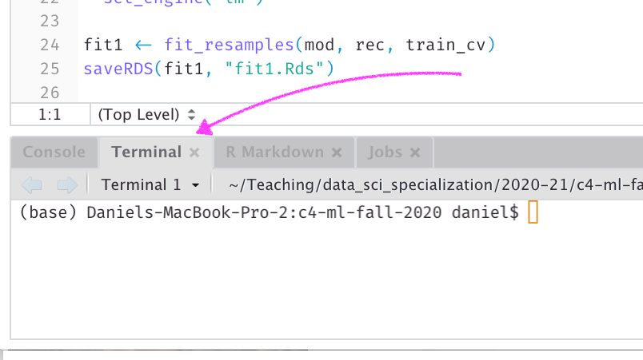
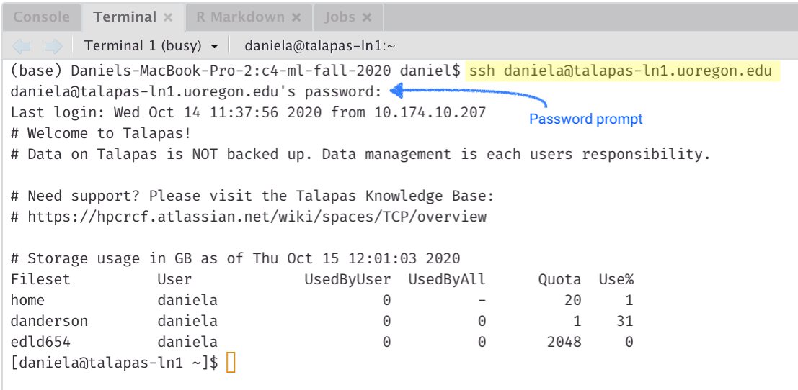
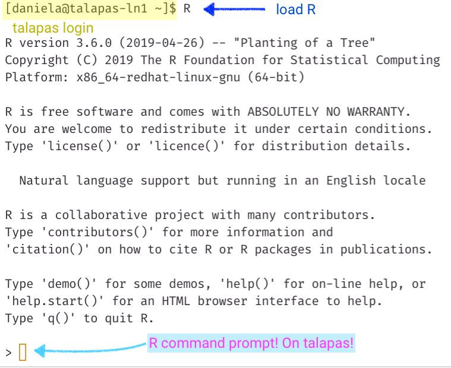

```{r setup, include=FALSE}
knitr::opts_chunk$set(echo = TRUE)
```

When working on the UO talapas computing cluster, you will often need to install new packages. In this course, we will need the tidyverse and tidymodels. If you should happen to need any additional packages as the term goes on, please repeat these steps for the corresponding package

## Mac/Linux Users
In RStudio look in your console and see if you see a "Terminal" tab. If so, click it, if not, go to Tools -> Terminal -> New Terminal



## Windows users
First download [MobaXterm](https://mobaxterm.mobatek.net) (home edition). You should then be able to use it for everything that follows, using MobaXterm in place of the RStudio terminal. Although the screenshots below use the RStudio terminal, the process should be equivalent.


# Install steps
In the terminal or MobaXterm, type `ssh duckid@talapas-ln1.uoregon.edu`

replacing `duckid` for your actual duckid. For example, I would enter `ssh daniela@talapas-ln1.uoregon.edu`

You will then be prompted for your password.

**Important!**

When you type in your password (UO password) it will not show any characters you type. Just trust that it is actually registering them.



Once you see `[duckid@talapas-ln1 ~]$` you are connected to talapas. Now load R by just typing `R`.



Now, we're going to just install packages like normal. The reason we're doing this before class is because this step will take a while - possibly 15+ minutes. So please be patient.

Enter the following code: `install.packages("tidyverse", "tidymodels")` and hit return. It will then prompt you

> Warning in install.packages("tidyverse", "tidymodels") :
  'lib = "tidymodels"' is not writable
Would you like to use a personal library instead?

Type `yes` and press return. It will then provide a second prompt that is similar but asking if you'd like to *create* a personal library. Type `yes` again and hit return. Finally, it will ask you to select a CRAN mirror. You can select any of them you want. I usually use `1: 0-Cloud` which is the RStudio mirror. You just need to type 1 then hit return (if you're on a Mac) or select it from the menu (if you're using MobaXterm).

At this point you just have to wait for everything to be done. You can leave your computer if you'd like while it installs, or work on something else. There's no need to monitor it.

Once the install is complete try running `library(tidyverse)` to make sure it loads. You can try the same with tidymodels if you'd like. 

If you run into any issues please contact me or Joe. I'm more likely to be able to help you if you have a Mac, and Joe is more likely to be able to help you if you have a Windows machine.

Once you feel confident that everything has installed correctly, type `q()` to exit R. This will put you back to where you started with talapas. Then type `exit` and you will be back on your local.